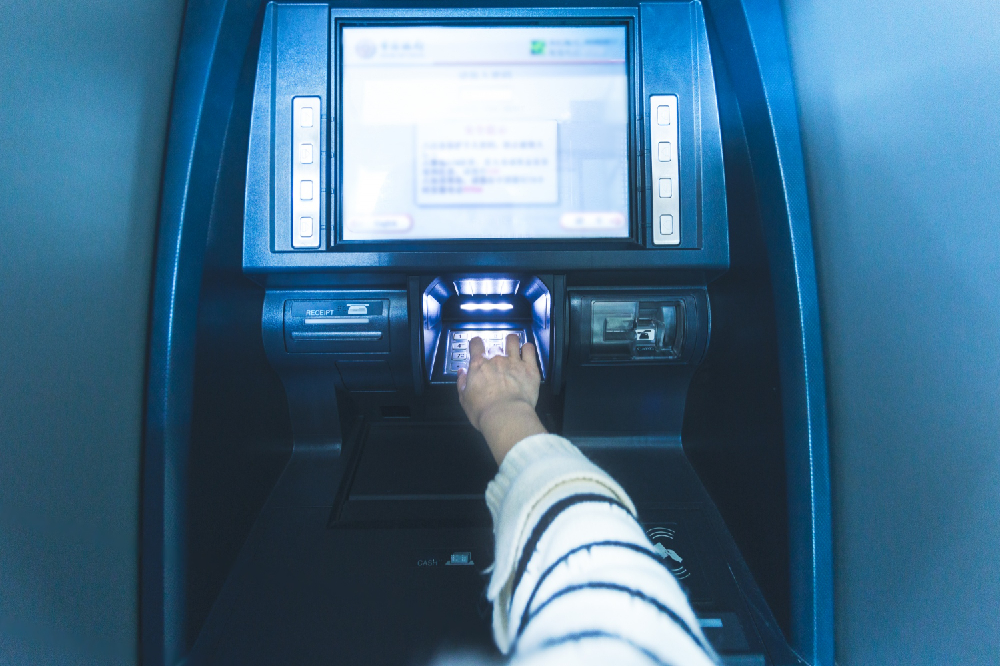

**Wisabi ATM Report**

**Introduction:**

This Power BI report analyzes ATM transaction data for Wisabi Bank, providing insights into customer behavior, ATM usage, and opportunities to improve services.

**_Disclaimer_:** This report is based on a practice dataset, creating a fictional scenario for exploration, and does not represent any actual company, institution, or country. The insights presented in this report are based on simulated ATM transaction data and are intended for demonstration purposes only. They showcase the capabilities of Power BI.

**Problem Statement:**

1. What is the average transaction amount by location and transaction type?
2. Which ATM location has the highest number of transactions per day, and at what time of the day do the transactions occur most frequently?
3. Which age group has the highest number of transactions, and which transaction type do they usually perform?
4. What is the trend of transaction volume and transaction amount over time, and are there any seasonal trends or patterns?
5. What is the most common transaction type, and how does it vary by location and customer type (Wisabi customer vs. non-Wisabi customer)?
6. What is the average transaction amount and transaction frequency per customer by age group?
7. What is the percentage of transactions that are withdrawals, savings, balance enquiries, and transfers, and how does it vary by location?
8. Which ATM locations have the highest and lowest utilization rates, and what factors contribute to this utilization rate?
9. What is the average transaction time by location, transaction type, and time of day, and how does it vary by customer type and occupation?

## Skills Demonstrated
- Extract, Transform, Load (ETL)
- Data Modeling
- New Measures With DAX
- Data Visualization
- Power Query
- Power BI
- Data Analysis
- Customer Segmentation
- Performance Evaluation

**Modeling:**

The dataset is structured to facilitate analysis, with key entities including customers, locations, calendar dates, transaction types, and transactions. The transaction data serves as the primary source of insights, supplemented by customer and location details.

**Visualization:**

The report contains three pages:

1. Home
2. Overview
3. Demography

The dataset for this project, sourced from the Wisabi Analytics YouTube channel, offers a comprehensive learning experience in data analysis. Visit [Wisabi Analytics](https://www.youtube.com/@wisabianalytics/featured) Youtube Page and take the Microsoft Power BI tutorial playlist.

You can also interact with the interactive report I designed [here](https://app.powerbi.com/view?r=eyJrIjoiMTExNDgxMGEtNjA0YS00YmE1LWIxOWQtM2I5YTY3Y2QyY2MxIiwidCI6IjUxN2QzNTAyLTI5MDEtNGRlMi1hODdiLTk1YzUwN2E5YTA4OCJ9).

**Overview Page:**

- **Transaction Tempo:** Witness the ebb and flow of transactions over time, analyzing trends in both count and average amount.
- **Duration vs. Value:** See how transaction duration relates to average transaction amount, uncovering potential insights into customer behavior.
- **Utilization Rates:** Explore the utilization rates of each ATM location, identifying areas for improvement or optimization.

**Demography Page:**

- **Age and Transaction Activity:** Discover how transaction frequency varies across different age groups, gaining valuable insights into customer preferences.
- **Who Uses What:** Analyze transaction count and average duration based on customer demographics like age, gender, and occupation, revealing deeper patterns.
- **Customers Check:** Examine the distribution of transaction types by customer type (Wisabi vs. non-Wisabi), understanding your customer base and potential outreach opportunities.

**Conclusion and Recommendations:**

In the dynamic world of banking, understanding the present and forecasting future trends is crucial. This project was undertaken with the purpose of analyzing the ATM transaction data for Wisabi Bank, aiming to gain insights on customer behavior and ATM usage. The analysis has successfully identified opportunities to enhance the customer experience.

The insights derived from this analysis underscore the value of leveraging data to understand customer behavior, optimize services, and ultimately drive growth and customer satisfaction. As we move forward, we will continue to monitor and analyze ATM transactions, adjusting our strategies as needed to meet the evolving needs of our customers. This approach exemplifies our dedication to continuous improvement and adaptability in our services.

The recommendations section below will provide specific actions based on these insights. These recommendations will serve as a roadmap for improving ATM services, enhancing customer experience, and improving operational efficiency.

## Recommendations

1. **ATM Distribution Optimization:** Kano, with an ATM utilization rate of 18.6%, indicates a high demand for cash transactions. This suggests an opportunity to enhance customer service by increasing the number of ATMs in the region. Conversely, the Federal Capital Territory (FCT) has the lowest utilization rate of 8.5%, indicating a potential oversupply of ATMs. A review of the ATM distribution strategy in this area could lead to improved resource allocation.

2. **Demographic Targeting:** Our data shows that customers aged 15-25 years have the highest transaction frequency of 260. This presents an opportunity to increase overall ATM usage by tailoring services and marketing efforts to this demographic.

3. **Service Efficiency Improvement:** The average transaction duration for withdrawals in Kano exceeds 5 minutes. Reducing this time could significantly improve customer satisfaction and potentially increase transaction volume.

4. **Extended Service Hours in Lagos:** Our data shows significant ATM activity in Lagos after 7 pm. Extending service hours or increasing the number of ATMs could help meet this demand and improve customer service.

5. **Promotion of Deposit and Transfer Services:** While withdrawals are the most common transaction type, accounting for over 50% of transactions, deposits and transfers each account for over 10%. Promoting these services could diversify usage and increase overall transaction volumes.

6. **Resource Planning for High-Activity Months:** High transaction activity is observed in January, March, May, July, October, and December. Ensuring adequate resources during these months could help handle the increased volume and maintain service quality.
